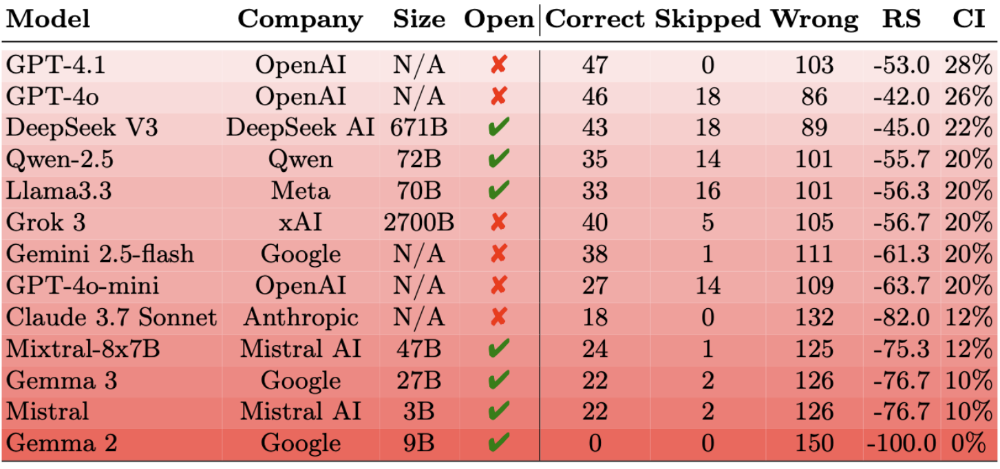
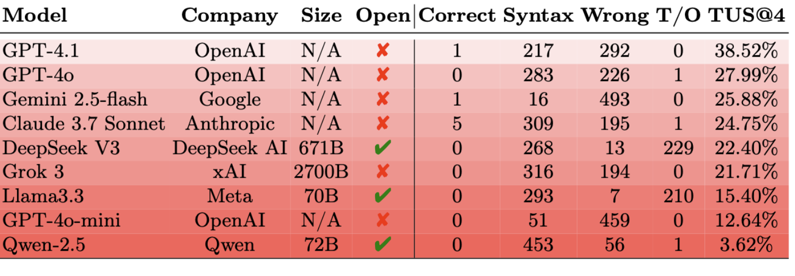

# DFIR-Metric: A Benchmark Dataset for Evaluating Large Language Models in Digital Forensics and Incident Response


## Description

**DFIR-Metric** is a comprehensive benchmark developed to assess the performance of Large Language Models (LLMs) in the field of Digital Forensics and Incident Response (DFIR), aiming to fill the gap in standardized evaluation methods. The benchmark comprises three key components: (a) MODULE I: expert-validated knowledge-based questions , (b)  MODULE II: realistic forensic challenges that require multi-step reasoning, (c) MODULE III: practical string search tasks derived from the NIST Computer Forensics Tool Testing Program (CFTT). We evaluated state-of-the-art LLMs using the DFIR-Metric benchmark and introduced a new metric—*Task Understanding Score (TUS)*—to more effectively assess performance in complex scenarios where overall accuracy is low.

## Framework


## Authors

Bilel Cherif, Aaesha Aldahmani, Saeed Alshehhi, Tamas Bisztray, Richard A. Dubniczky, Norbert Tihanyi

## Dataset

|Module|Dataset|Test Count|Details|
|--|--|--|--|
|`MCQ`|[DFIR-Metric-MCQ.json](/DFIR-Metric-MCQ.json)|700|Expert-reviewed 4-option quiz questions to test knowledge|
|`CTF`|[DFIR-Metric-CTF.json](/DFIR-Metric-CTF.json)|150|Realistic forensic challenges requiring multi-step reasoning in a CTF style|
|`NSS`|[DFIR-Metric-NSS.json](/DFIR-Metric-NSS.json)|500|Forensic disk analysis using NIST string search challenges|


## Module I - 700 Multiple-Choice Questions

This module contains 700 multiple-choice questions derived from industry-standard certifications and official documentation. Each question has been reviewed and validated by human experts to ensure high quality. You can download the dataset from: [DFIR-Metric-MCQ.json](/DFIR-Metric-MCQ.json)

An example question from the `DFIR-Metric-MCQ` dataset:
```python
{
  "question": "Which code does the FAT file system use to mark the file as deleted?",
  "options": {
    "A": "ESh",
    "B": "h5E",
    "C": "E5h",
    "D": "5Eh"
  },
  "answer": "C"
}
```
Fourteen state-of-the-art LLMs have been evaluated using the DFIR-Metric MCQ dataset. The results of this evaluation are presented in the following table:


## Module II - CTF Style Practical Challenges

This module includes 50 dynamic templates for CTF-style forensic challenges. Each template contains variables that can be randomized, allowing for the generation of an unlimited number of unique challenges from the base templates. For our evaluation, we used k=3, resulting in 150 practical CTF-style challenges for testing LLMs. You can download the dataset of 150 challenges here: [DFIR-Metric-CTF.json](/DFIR-Metric-CTF.json)

An example practical question from the `DFIR-Metric-CTF` dataset. Identify the suspicious IP address responsible for potentially malicious activity based on the following web server logs:

```python

10.12.19.134 - - [22/May/2025:13:00:07 +0000] "POST /api/v1/Li4vLi4vLi4vLi4vYmluL2Jhc2g= HTTP/1.1" 403 1434  
192.168.181.243 - - [22/May/2025:05:08:31 +0000] "GET /about.html HTTP/1.1" 200 1434  
192.168.209.58 - - [22/May/2025:11:14:49 +0000] "GET /index.html HTTP/1.1" 200 1434  
192.168.58.17 - - [22/May/2025:16:14:29 +0000] "GET /index.html HTTP/1.1" 200 1434  
192.168.133.223 - - [22/May/2025:03:24:11 +0000] "GET /contact.html HTTP/1.1" 200 1434  
192.168.92.89 - - [21/May/2025:21:51:37 +0000] "GET /contact.html HTTP/1.1" 200 1434  
192.168.58.169 - - [21/May/2025:20:49:46 +0000] "GET /index.html HTTP/1.1" 200 1434  
192.168.218.239 - - [22/May/2025:08:48:20 +0000] "GET /contact.html HTTP/1.1" 200 1434
192.168.205.104 - - [22/May/2025:17:10:03 +0000] "GET /download?file=....//....//etc/passwd HTTP/1.1" 403 1434  
192.168.211.175 - - [22/May/2025:04:35:56 +0000] "POST /about.html HTTP/1.1" 200 1434  
192.168.160.92 - - [21/May/2025:22:13:09 +0000] "GET /index.html HTTP/1.1" 200 1434  
192.168.198.181 - - [22/May/2025:04:06:33 +0000] "POST /contact.html HTTP/1.1" 200 1434  

answer: <xml>192.168.205.104</xml>
```

The example above represents a relatively simple task for LLMs. However, challenges such as reverse-engineering cryptographic keys or analyzing memory dumps significantly increase the complexity of the dataset compared to theoretical questions. As a result, the Confidence Index (CI) of the best-performing LLMs (without tool assistance) is substantially lower than their scores on multiple-choice questions. The results can be viewed here:



### Generate new challenges for Module II 

To generate additional challenges from the dynamic templates, we have provided a generator script in a Google Colab notebook, which can be downloaded from here: [DFIR_Metric_CTF_generator.ipynb](./assets/DFIR_Metric_CTF_generator.ipynb)

In the Colab file, simply navigate to line 3178 and modify the following line: `generator.save_to_file(k=3)`. Change k=3 to any desired number. For example, setting k=10 will generate a new dataset containing 50 × 10 = 500 practical CTF-style challenges.

## Module III 


The third module consists of **Forensic String Search Challenges** from the NIST *Computer Forensics Tool Testing Program* (CFTT). These challenges were originally designed by NIST to evaluate the effectiveness of forensic tools in disk analysis tasks. They are hands-on, practical challenges focused on string analysis.

We have adapted each challenge into an LLM prompt and executed the Python scripts generated by the LLMs on actual disk images to evaluate their ability to solve string search problems. Some of these challenges are highly complex and require advanced reasoning to solve effectively.
```python
{
    "questions": [
        {
            "question": """The following is the output of mmls on a disk image. Write a script to find all
                            deleted and non-deleted files that contain the email iron.man@marvel.com in the
                            first Windows data partition. The output should be a list sorted by inode in the
                            format: <xml>["inode:filename", "inode:filename", ...]</xml>. Deleted files should
                            have filenames starting with DELETED, and non-deleted files should start with LIVE.

                            For example:
                            <xml>["122150:DELETED-test-email.txt", "122152:LIVE-test-email.txt"]</xml>.

                            The mmls command output for ss-win-07-25-18.dd is:
                            
                            mmls ss-win-07-25-18.dd
                            GUID Partition Table (EFI)
                            Offset Sector: 0
                            Units are in 512-byte sectors
                            
                                Slot      Start        End          Length       Description
                            000:  Meta      0000000000   0000000000   0000000001   Safety Table
                            001:  -------   0000000000   0000000033   0000000034   Unallocated
                            002:  Meta      0000000001   0000000001   0000000001   GPT Header
                            003:  Meta      0000000002   0000000033   0000000032   Partition Table
                            004:  000       0000000034   0000976561   0000976528   Basic data partition
                            005:  001       0000976562   0001953123   0000976562   Basic data partition
                            006:  002       0001953124   0002929685   0000976562   Basic data partition
                            007:  003       0002929686   0003906247   0000976562   Basic data partition
                            008:  -------   0003906248   0004097711   0000191464   Unallocated
                            """,
            "answer": [
                "122150:DELETED-email-iron-fat-ascii.txt",
                "122154:DELETED-email-iron-fat-utf-16-be.txt",
                "122158:DELETED-email-iron-fat-utf-16-le.txt",
                "122162:DELETED-email-iron-fat-utf-8.txt"
            ]
        }
    ]
}
```
The models are struggling to accurately locate the target files within the disk images and, in most cases, failed to solve any of the tasks completely. To address this, we introduced the *Task Understanding Score (TUS)* — a metric designed to assess how well models comprehend the tasks, even when they don't produce fully correct answers. TUS allows us to award partial credit for meaningful progress, such as correctly identifying the relevant partition or detecting the appropriate file extension. This approach enables us to evaluate model performance more effectively, even when overall accuracy remains near zero. The results can be viewed here:




### The NIST JSON generator for Module III

We provide a Google Colab notebook to generate the JSON file for the NIST Forensic String Search Challenges. The process begins by downloading the disk images directly from the NIST website. Our code then extracts the correct ground truth data from these images, which is used as a reference to evaluate the responses generated by LLMs. We prompted the LLMs to write scripts for each challenge and executed those scripts to assess how effectively the models could extract specific patterns from the forensic disk images. The Google Colab notebook can be downloaded from here: [DFIR_Metric_CTF_generator.ipynb](./assets/DFIR_Metric_NSS_generator.ipynb)

