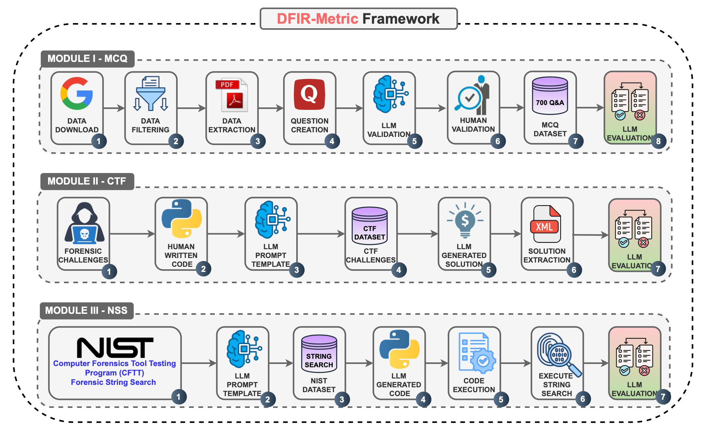
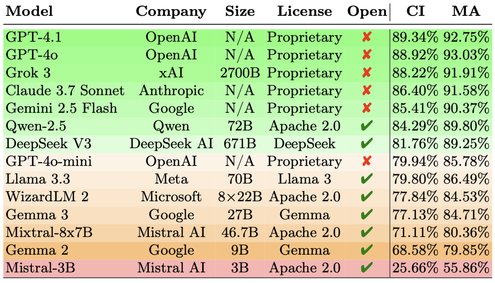

# DFIR-Metric: A Benchmark Dataset for Evaluating Large Language Models in Digital Forensics and Incident Response


## Description

**DFIR-Metric** is a comprehensive benchmark developed to assess the performance of Large Language Models (LLMs) in the field of Digital Forensics and Incident Response (DFIR), aiming to fill the gap in standardized evaluation methods. The benchmark comprises three key components: (a) MODULE I: expert-validated knowledge-based questions , (b)  MODULE II: realistic forensic challenges that require multi-step reasoning, (c) MODULE III: practical string search tasks derived from the NIST Computer Forensics Tool Testing Program (CFTT). We evaluated state-of-the-art LLMs using the DFIR-Metric benchmark and introduced a new metric—*Task Understanding Score (TUS)*—to more effectively assess performance in complex scenarios where overall accuracy is low.

## Framework



## Authors

Bilel Cherif, Aaesha Aldahmani, Saeed Alshehhi, Tamas Bisztray, Richard A. Dubniczky, Norbert Tihanyi

## Dataset

|Module|Dataset|Test Count|Details|
|--|--|--|--|
|`MCQ`|[DFIR-Metric-MCQ.json](/DFIR-Metric-MCQ.json)|700|Expert-reviewed 4-option quiz questions to test knowledge|
|`CTF`|[DFIR-Metric-CTF.json](/DFIR-Metric-CTF.json)|150|Realistic forensic challenges requiring multi-step reasoning in a CTF style|
|`NSS`|[DFIR-Metric-NSS.json](/DFIR-Metric-NSS.json)|500|Forensic disk analysis using NIST string search challenges|


## Module I - 700 Multiple-Choice Questions

This module contains 700 multiple-choice questions derived from industry-standard certifications and official documentation. Each question has been reviewed and validated by human experts to ensure high quality. You can download the dataset from: [DFIR-Metric-MCQ.json](/DFIR-Metric-MCQ.json)

An example question from the dataset:
```json
{
  "question": "Which code does the FAT file system use to mark the file as deleted?",
  "options": {
    "A": "ESh",
    "B": "h5E",
    "C": "E5h",
    "D": "5Eh"
  },
  "answer": "C"
}
```
Fourteen state-of-the-art LLMs have been evaluated using the DFIR-Metric MCQ dataset. The results of this evaluation are presented in the following table:




## Module II 

This moduele contains dynamic template for CTFF-style Forensic Challenges.  


## Module III 

